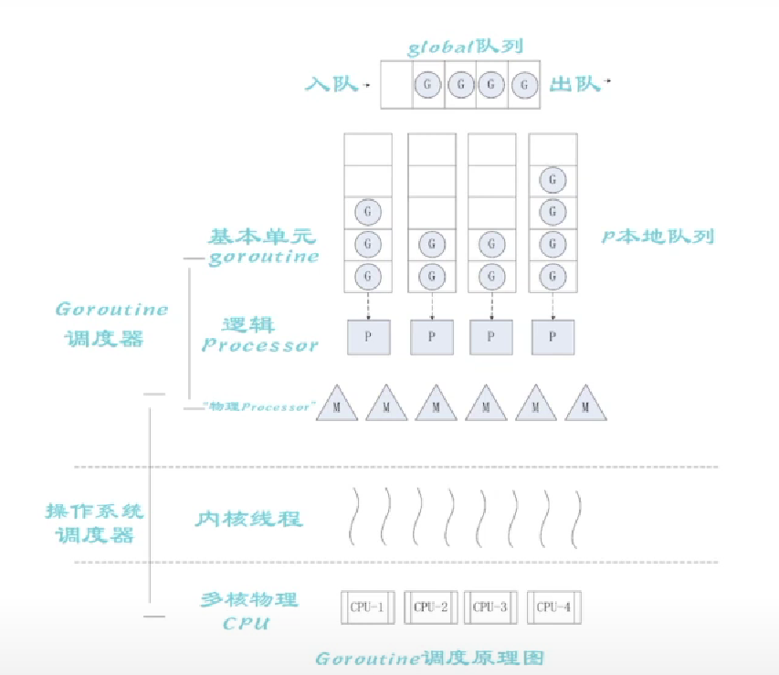
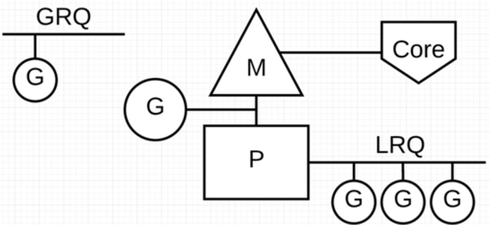

# Go语言协程机制探寻

## 1. 问题的引入

+ 从最底层的系统调用（select, poll, epoll等）到上层库（libevent, libev, boost等），来编写高并发高可用的网络服务器是一件很困难的事。问题在于：系统虽然提供了可以完成任务的足够原材料，但处理实际完成任务细节的难度高，需要的脑力成本也很高。
+ 因此，Go语言内置的协程机制解决了这一问题。当然，其实现也离不开系统本身：系统调用、线程、IO复用等操作还是需要系统的支持。但通过在语言层面进行抽象，能使编写程序的人员忽略这些繁复的细节，通过Go语言内置的关键字`go`即可使用Go为我们处理好的协程功能，从而极大降低程序编写的复杂性，易于使用也易于后续维护。

## 2. 基本概念

### 2.1 进程、线程、协程

+ 进程：系统进行资源分配的基本单位，有自己独立的内存空间。
+ 线程：CPU调度的单位，依附于进程而存在。同一进程所创建出的线程**共享**本进程的大部分资源（PID, PPID, 进程组ID，会话ID，用户ID，用户组ID，文件描述符表，信号，文件系统umask与pwd等，内存虚拟地址空间），而只有少部分资源（线程ID，栈，本地变量和函数调用链接信息，信号掩码，线程特有数据，error变量，实时调度策略和优先级）是线程**私有**的。
+ 协程：可以理解为轻量级线程。完全在用户态实现，映射到系统中的线程上执行。

### 2.2 上下文切换带来的开销

+ 由于中断处理，多任务处理，用户态切换等原因会导致 CPU 从一个线程切换到另一个线程，切换过程需要保存当前进程的状态并恢复另一个进程的状态。

+ **上下文切换的代价是高昂的**，因为在核心上交换线程会花费很多时间。上下文切换的延迟取决于不同的因素，大概在在 50 到 100 纳秒之间。考虑到硬件平均在每个核心上每纳秒执行 12 条指令，那么一次上下文切换可能会花费 600 到 1200 条指令的延迟时间。实际上，上下文切换占用了大量程序执行指令的时间。

+ 如果存在**跨核上下文切换**（Cross-Core Context Switch），可能会导致 CPU 缓存失效（CPU 从缓存访问数据的成本大约 3 到 40 个时钟周期，从主存访问数据的成本大约 100 到 300 个时钟周期），这种场景的切换成本会更加昂贵。

### 2.3 Go语言本身对并发的支持

+ Golang 从 2009 年正式发布以来，依靠其极高运行速度和高效的开发效率，迅速占据市场份额。Golang 从语言级别支持并发，通过轻量级协程 Goroutine 来实现程序并发运行。

+ **Goroutine 非常轻量**，主要体现在以下两个方面：

+ **上下文切换代价小：** Goroutine 上下文切换只涉及到三个寄存器（PC / SP / DX）的值修改；而对比线程的上下文切换则需要涉及模式切换（从用户态切换到内核态）、以及 16 个寄存器、PC、SP…等寄存器的刷新；

+ **内存占用少：**线程栈空间通常是 2M，Goroutine 栈空间最小 2K；

+ Golang 程序中可以轻松支持**10w 级别**的 Goroutine 运行，而线程数量达到 1k 时，内存占用就已经达到 2G。

## 3. Goroutine的内部实现

### 3.1 土拨鼠解释

+ **土拨鼠(Gopher)的工作任务是：**工地上有若干砖头，地鼠**借助小车**把砖头运送到火种上去烧制。

+ **M 就可以看作图中的地鼠，P 就是小车，G 就是小车里装的砖。**
+ **Goroutine(G)：**通过 Go 关键字就是用来创建一个 Goroutine，也就相当于制造一块砖(G)，然后将这块砖(G)放入当前这辆小车(P)中。
+ **Processor（P）：**根据用户设置的 **GoMAXPROCS **值来创建一批小车(P)。
+ **Machine (M)：**土拨鼠(M)不能通过外部创建出来，只能砖(G)太多了，土拨鼠(M)又太少了，实在忙不过来，**刚好还有空闲的小车(P)没有使用**，那就从别处再借些土拨鼠(M)过来直到把小车(P)用完为止。

### 3.2 G-P-M模型

+ 通过土拨鼠解释，我们把其真实情况在真实的计算机中对应起来。从顶部到底部分别是：Go用户使用协程，此时Go runtime创建一个G（协程），并加入到一个P（队列）中，而M（线程）负责处理P中的任务。M负责把任务对应到操作系统内核中真实的线程，而操作系统内核把内核对应到多核心的物理CPU中，从而实现资源的有效利用。

+ P 代表可以“并行”运行的逻辑处理器，每个 P 都被分配到一个系统线程 M，G 代表 Go 协程。
+ Go 调度器中有两个不同的运行队列：**全局运行队列(GRQ)和本地运行队列(LRQ)。**

### 3.3 调度策略

+ **为了更加充分利用线程的计算资源，Go 调度器采取了以下几种调度策略：**
+ **任务窃取（work-stealing）**：当每个 P 之间的 G 任务不均衡时，调度器允许从 GRQ，或者其他 P 的 LRQ 中获取 G 执行。
+ **减少阻塞**：
  1. 由于**原子、互斥量或通道操作**调用导致 Goroutine 阻塞，调度器将把当前阻塞的 Goroutine 切换出去，重新调度 LRQ 上的其他 Goroutine；
  2. 由于**网络请求和 IO 操作**导致 Goroutine 阻塞**
     + Go 程序提供了**网络轮询器（NetPoller）**来处理网络请求和 IO 操作的问题，其后台通过 kqueue（MacOS），epoll（Linux）或 iocp（Windows）来实现 IO 多路复用。
     + 通过使用 NetPoller 进行网络系统调用，调度器可以防止 Goroutine 在进行这些系统调用时阻塞 M。这可以让 M 执行 P 的 LRQ 中其他的 Goroutines，而不需要创建新的 M。有助于减少操作系统上的调度负载。
  3. 当调用一些**系统方法**的时候，如果系统方法调用的时候发生阻塞，这种情况下，网络轮询器（NetPoller）无法使用，而进行系统调用的 Goroutine 将阻塞当前 M。此时M与调用系统方法的G被剥离开来放在一边，而原本的P则从队列中取出下一个G准备执行。如果此时M不够用，那么调度器会向系统再次申请一个新线程来完成任务。
  4. 如果在 Goroutine 去执行一个 sleep 操作，导致 M 被阻塞了。Go 程序后台有一个监控线程 sysmon，它监控那些长时间运行的 G 任务然后设置**可以强占的标识符**，别的 Goroutine 就可以抢先进来执行。

## 4. 总结

Go语言在其内部实现了一组协程机制，通过一系列的操作来简化用户创建并发任务的步骤。用户只需要调用go语句创建一个协程，而不需要知道其内部的细节（与需要自己处理大部分细节的C++库形成对比），就能有效率地利用多核处理器来处理问题。Go语言内部使用的是G-P-M模型，并通过一系列的调度算法与阻塞处理方法，使这一套协程体系效率大增。这相当于在语言层面创建一层抽象机制，类似的腾讯的开源libco库协程实现也是这种思想，把协程功能通过库提供给C++编写者，并向上提供一层简单的API，屏蔽内部繁复的细节。

## 5. 参考文献

+ https://zhuanlan.zhihu.com/p/111346689
+ https://zhuanlan.zhihu.com/p/51078499
